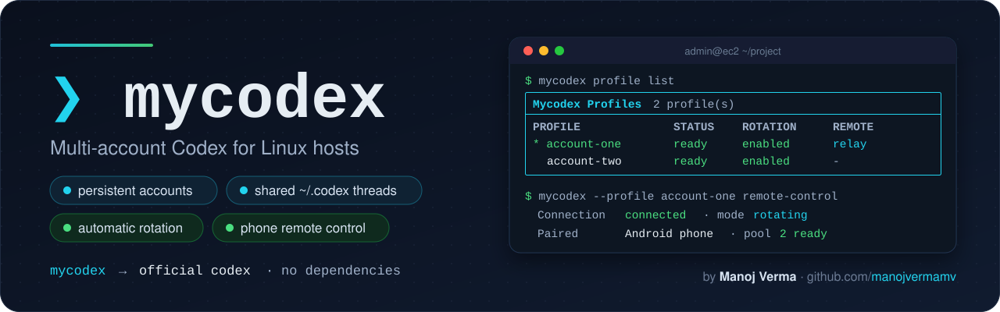

<p align="center">
  
</p>

# mycodex

[](https://www.python.org/)
[](#requirements)
[](https://developers.openai.com/codex/cli)
[](#installation)
[](LICENSE)

`mycodex` runs the **official Codex CLI** with several ChatGPT accounts on one Linux host.
Each account keeps its own persistent login, every account shares one `~/.codex` (same
threads, history and settings), requests move to another ready account when one runs out,
and a supervised service keeps **Codex remote control** available to the ChatGPT phone app.

The Codex you get is the unmodified original. mycodex is a small, dependency-free Python
tool around it: it prepares each account's Codex home, runs a local rotation proxy in
front of the ChatGPT backend, and manages the remote-control service.

## Contents

- [Why mycodex](#why-mycodex)
- [How it works](#how-it-works)
- [Requirements](#requirements)
- [Installation](#installation)
- [Quick start](#quick-start)
- [Coming from prodex](#coming-from-prodex)
- [Daily use](#daily-use)
- [Commands](#commands)
- [Remote control](#remote-control)
- [Projects and new threads](#projects-and-new-threads)
- [Rotation](#rotation)
- [Accounts and shared threads](#accounts-and-shared-threads)
- [Files and layout](#files-and-layout)
- [Troubleshooting](#troubleshooting)
- [Security and responsible use](#security-and-responsible-use)
- [Compatibility](#compatibility)
- [Documentation](#documentation)
- [Author](#author)
- [License](#license)

## Why mycodex

Use `mycodex` if you want to:

- use several ChatGPT/Codex accounts from one terminal, without logging in again
- keep one set of threads: every account sees the same sessions, history, skills and config
- keep working when an account hits its usage limit, because the next request goes to the
  next ready account
- drive the host from the ChatGPT phone app, with remote control that survives SSH
  disconnects and reboots, and the same thread list as your terminal
- see every account's quota, the phone link and all Codex processes at a glance

If you use a single account and never use remote control, plain `codex` is enough.

## How it works

```text
mycodex ──► official codex (TUI, exec, resume, fork, remote-control: unchanged)
   │              │
   │              └─ model requests ──► mycodex rotation proxy (127.0.0.1) ──► chatgpt.com
   │                                        picks a ready account per request
   ├─ accounts: one CODEX_HOME per account in ~/.codex/profiles/<name>, linked to ~/.codex
   └─ quota, rotation policy, remote-control service, threads, diagnostics
```

- **Accounts**: each account is a real Codex home, `~/.codex/profiles/<name>`, with its own
  `auth.json`. You log in with the official `codex login`, once per account.
- **Shared threads**: sessions, history, thread names, config, skills and Codex's databases
  are shared through `~/.codex`, so a thread started on one account continues on another.
- **Rotation**: Codex keeps its built-in `openai` provider and only its base URL points at a
  local proxy. The proxy sends each request with the credentials of a ready account and
  moves it to the next account when the backend reports a usage or rate limit, before
  anything reaches Codex.
- **Remote control**: a systemd user service runs the official `codex remote-control`,
  behind the same kind of proxy, and restarts it if it stops.

See [docs/architecture.md](docs/architecture.md) for the details.

## Requirements

| Requirement | Notes |
|---|---|
| Linux with a systemd user instance | Debian 13 tested. Enable lingering so remote control survives logout and reboot: `sudo loginctl enable-linger $USER` |
| Python 3.10 or newer | standard library only; nothing to `pip install` |
| [Codex CLI](https://developers.openai.com/codex/cli) 0.160.x | the official standalone CLI, `codex --version` |
| ChatGPT accounts with Codex access | any plan that can use Codex |
| ChatGPT mobile app (optional) | for remote control, signed in to the relay account |

## Installation

1. Install the official Codex CLI (skip if you have it):

   ```bash
   curl -fsSL https://chatgpt.com/codex/install.sh | sh
   ```

2. Install mycodex:

   ```bash
   git clone https://github.com/manojvermamv/mycodex.git ~/mycodex
   ~/mycodex/install.sh
   ```

   `install.sh` links `~/.local/bin/mycodex` to the launcher and creates the private
   `state/` directory. Make sure `~/.local/bin` is on your `PATH`.

3. Check the stack:

   ```bash
   mycodex --version
   mycodex doctor
   ```

## Quick start

```bash
mycodex profile add                         # log in an account (device code); repeat per account
mycodex quota                               # every account's plan, quota and rotation readiness
mycodex                                     # the official Codex TUI, rotation on
mycodex --profile <name> remote-control     # keep the host available to the ChatGPT phone app
```

The step-by-step guide is in [QUICKSTART.md](QUICKSTART.md).

## Coming from prodex

If your accounts live in prodex (`~/.prodex/profiles`), take them over without logging in
again:

```bash
mycodex migrate --dry-run     # what would move
mycodex migrate               # move them into ~/.codex/profiles
```

Each account home is moved with one rename, so its login, refresh token and
`installation_id` (the identity a paired phone knows) stay exactly as they were, and a link
is left at the old path. If the remote-control service is running, it restarts on the new
homes and the phone reconnects by itself.

Threads that prodex created carry its provider tag, which the phone does not list. Make a
copy the phone can see with `mycodex threads adopt <ID>` (see [Accounts and shared
threads](#accounts-and-shared-threads)).

Once `mycodex doctor` passes, prodex is no longer needed and can be removed completely.
Close any session you started through prodex (`pgrep -a prodex` shows none), then delete
its binary, its state directory (by now it holds only links to the new homes), the empty
lock files it left in `~/.codex` and its temporary files:

```bash
rm ~/.local/bin/prodex
rm -rf ~/.prodex
rm -f ~/.codex/.prodex-session-repair.lock ~/.codex/sessions/.prodex-maintenance.lock
rm -rf /tmp/prodex-*
```

Keep the `export PATH="$HOME/.local/bin:$PATH"` line its installer may have added to your
shell profile: `codex` and `mycodex` live there too.

## Daily use

The commands you will use most, shown with two example accounts, `work` and `personal`. A
profile can be named by its full name, an alias, the account email or any unique prefix
(`work` for `work_example.com`).

```bash
# ── Start Codex ─────────────────────────────────────────────────────────────
mycodex                                    # Codex TUI as the active account, rotation on
mycodex --profile personal                 # start on another account
mycodex resume --last                      # continue your latest thread, on any account
mycodex resume <thread id>                 # continue a specific thread (ids: mycodex threads)
mycodex exec "summarise the last 10 commits"   # one-shot run, no TUI (inside a git repo)
mycodex -m <model>                         # any codex flag or command passes straight through
mycodex --no-rotate                        # keep this session on one account (no proxy)
mycodex --dry-run                          # show what would be launched, start nothing

# ── Quota and rotation ──────────────────────────────────────────────────────
mycodex quota                              # 5h / weekly quota left and reset times, every account
mycodex quota --watch                      # same, refreshed every 60 s (Ctrl-C to quit)
mycodex rotation status                    # order, disabled and paused accounts, who is ready
mycodex rotation log -f                    # watch switches and pauses live (Ctrl-C to quit)
mycodex rotation reset                     # clear pauses once a limit has really reset
mycodex rotation order work personal       # which account is tried first
mycodex rotation disable personal          # never switch to it (`rotation enable personal` undoes)

# ── Phone (remote control) ──────────────────────────────────────────────────
mycodex remote status                      # connected? paired phone? proxy and rotation pool
mycodex remote logs -f                     # follow the service log (Ctrl-C to quit)
mycodex remote restart                     # restart the phone link with the same settings
mycodex --profile work remote-control      # (re)start it as work, rotating mode
mycodex remote-control --pinned            # one account only, no rotation
mycodex remote pair                        # pairing code for the ChatGPT app (new phone)
mycodex remote clients                     # paired devices (add --revoke ID to remove one)
mycodex remote stop                        # take the phone link offline

# ── Projects and threads ────────────────────────────────────────────────────
# new thread inside the project, visible on the phone:
mycodex remote seed ~/my-project --name "First task" --message "Describe the first task here"
mycodex threads                            # recent threads with their tag and folder
mycodex threads adopt <ID>                 # copy a hidden (non-openai) thread so the phone shows it

# ── Accounts (when needed) ──────────────────────────────────────────────────
mycodex profile list                       # all accounts: plan, status, quota, rotation, phone role
mycodex profile show work                  # one account: token expiry, quota windows, paths
mycodex profile use personal               # change the default account
mycodex profile add                        # log in another ChatGPT account (device code)
mycodex profile reauth personal            # log in again when it shows "auth invalid"
mycodex profile alias work_example.com phone   # then use --profile phone

# ── Health ──────────────────────────────────────────────────────────────────
mycodex status                             # one-screen overview of everything
mycodex doctor                             # full check; `mycodex doctor --fix` repairs what is safe
mycodex processes                          # every codex / mycodex process and its account
mycodex --version                          # mycodex and codex versions
mycodex help remote                        # options of any command

# ── Update mycodex ──────────────────────────────────────────────────────────
git -C ~/mycodex pull && ~/mycodex/install.sh && mycodex remote restart
```

Every command and option is listed in [Commands](#commands).

## Commands

<details>
<summary>Launch Codex</summary>

```bash
mycodex                               # TUI on the active account
mycodex --profile NAME                # start on NAME
mycodex resume --last                 # every codex command passes through unchanged
mycodex exec "review this repo"
mycodex --no-rotate …                 # this account only, no proxy
mycodex --rotate …                    # allow rotation even if it is disabled globally
mycodex --dry-run …                   # show what would be launched, without starting codex
mycodex -- --help                     # Codex's own help: everything after -- is verbatim
```

`codex login` and `codex logout` are replaced by the profile commands below, so a login
always lands in the right account home.

</details>

<details>
<summary>Accounts (profiles)</summary>

```bash
mycodex profile list [--json] [--no-quota]       # plan, status, quota, rotation, remote role
mycodex profile show NAME [--json]               # identity, plan expiry, token, quota, sharing, paths
mycodex profile current                          # the active account
mycodex profile use NAME                         # make NAME the active account
mycodex profile add [NAME] [--browser]           # log in a new account (device code by default)
mycodex profile reauth NAME [--browser]          # log in again after a token expires or is revoked
mycodex profile remove NAME [--yes] [--keep-home] [--force]
mycodex profile alias NAME SHORT                 # use SHORT anywhere an account is expected
mycodex profile alias SHORT --remove
```

`profile add` runs the official `codex login` in a fresh account home and names the
profile after the account email. Logging in to an account that already has a profile just
renews that profile's login. `profile reauth` refuses a login for a different account.
`profile remove` stops the account's Codex daemon, signs it out and deletes its home
(`--keep-home` moves the home aside instead). It refuses to remove the account the phone
is paired with unless you pass `--force`.

</details>

<details>
<summary>Quota</summary>

```bash
mycodex quota                 # all accounts: plan, status, remaining quota, resets, rotation readiness
mycodex quota NAME            # one account
mycodex quota --json          # machine-readable
mycodex quota --watch [SEC]   # keep the table open, refreshing every SEC seconds (default 60)
```

</details>

<details>
<summary>Rotation</summary>

```bash
mycodex rotation status               # global switch, order, disabled and paused accounts, who is ready
mycodex rotation disable              # launches use one account, no proxy
mycodex rotation enable
mycodex rotation disable NAME         # never switch to NAME
mycodex rotation enable NAME
mycodex rotation order A B C          # preferred order when an account has to be picked
mycodex rotation order --clear        # most quota left goes first
mycodex rotation reset [NAME…]        # clear pauses set after usage or rate limits
mycodex rotation log [-n N] [-f]      # switches, pauses and token refreshes
```

</details>

<details>
<summary>Remote control</summary>

```bash
mycodex --profile NAME remote-control            # start or switch the phone link (rotating mode)
mycodex --profile NAME remote-control --pinned   # one account, no rotation
mycodex remote-control --failover                # move the relay to the next ready account if it dies
mycodex remote-control --cwd ~/project           # default working directory for new phone threads
mycodex remote-control --foreground              # run in this terminal instead of the service

mycodex remote status [--json]       # mode, relay, connection, host, paired phones, proxy
mycodex remote pair [--no-wait]      # short-lived pairing code for the ChatGPT app
mycodex remote clients [--revoke ID] # paired devices
mycodex remote logs [-f] [-n N]      # service logs
mycodex remote seed [DIR] [--name N] [--message T] [--project P] [--no-wait]
                                     # new thread inside DIR's project (created if missing)
mycodex remote socket                # the server's control socket, for app-server proxy scripts
mycodex remote restart
mycodex remote stop                  # stop and disable the service (phone link offline)
```

`mycodex remote start` takes the same options as `remote-control`.

</details>

<details>
<summary>Threads</summary>

```bash
mycodex threads [--all] [-n N] [--json]          # recent threads with their provider tag
mycodex threads adopt ID [--name N] [--archive-original]
```

</details>

<details>
<summary>Diagnostics and migration</summary>

```bash
mycodex status [--json] [--no-quota]   # one-screen summary
mycodex processes [--json]             # every codex / mycodex process with role and account
mycodex doctor [--fix] [--yes] [--json]
mycodex migrate [--dry-run] [--yes] [--no-compat-links]
mycodex --version
mycodex help [COMMAND]
```

`doctor` checks the Codex install, every account's login, token, plan and pauses, the
shared `~/.codex` links, the socket directory, the remote service, its rotation proxy and
connection, conflicting remote servers, stale daemon settings, orphaned daemon updaters,
recent token invalidations, lingering and threads hidden from the phone. `--fix` repairs
what is safe to repair.

</details>

## Remote control

Remote control lets the ChatGPT phone app start and continue Codex threads on this host.
mycodex runs it as the systemd user service `mycodex-remote`, which restarts automatically
and keeps running after you close SSH.

```bash
mycodex --profile NAME remote-control
```

| Mode | Phone pairs with | Model turns | Choose it when |
|---|---|---|---|
| `rotating` (default) | NAME | move to the next ready account when one runs out | you want the phone to keep working across accounts |
| `pinned` | NAME | always NAME | you want one account only; add `--failover` to switch the relay when it runs out |

- **Pairing**: the phone must be signed in to the relay account (NAME). The host keeps the
  same identity across restarts and mode switches, so a paired phone stays paired. Use
  `mycodex remote pair` for a manual pairing code.
- **One thread list**: in both modes the server runs as Codex's built-in `openai` provider,
  exactly like your terminal sessions, so the phone and every terminal see the same threads.
- **One server per host**: starting the service stops Codex-managed remote daemons and
  turns their remote-control setting off, so the phone always reaches the mycodex service.
- **Projects**: see [Projects and new threads](#projects-and-new-threads).
- **Failover**: in pinned mode, `--failover` switches the relay to the next ready account
  when the current one is exhausted or can no longer log in. Pair the phone with that
  account afterwards.

## Projects and new threads

The phone groups threads by project. Codex files a thread under a project only when the
client asks for it, which the TUI and `codex exec` never do: a thread you start with
`mycodex` inside a project folder shows on the phone, but outside the project. To start a
new thread inside a project, go through the running server:

```bash
mycodex remote seed ~/MyProject --name "Login page" --message "Plan the login page first."
```

mycodex finds the project whose root is `~/MyProject` (or creates it), starts a thread
there, names it and sends your message as the first turn, all through the server's
app-server API. Continue on the phone or with `mycodex resume <thread id>`.

Scripts can make the same calls over the official relay,
`mycodex app-server proxy --sock "$(mycodex remote socket)"`. The protocol, the JSON-RPC
sequence, filing an existing thread under a project and a ready-to-use Python script are
in [docs/projects-and-threads.md](docs/projects-and-threads.md).

## Rotation

- **Per request**: a session starts on its account. When the backend answers with a usage
  limit, a rate limit or a deactivated workspace before any output, the request is sent
  again with the next ready account and the exhausted account is paused until its reset.
  The thread does not change; the turn simply completes on another account.
- **Never mid-answer**: once output has started streaming, nothing is retried or moved.
  When every account is exhausted, Codex shows the usage-limit message with the earliest
  reset time.
- **Stickiness**: a session stays on the account that served it while that account works,
  and a turn's routing token is only ever sent to the account that issued it.
- **Your policy applies in the session**: `rotation order` sets which account is tried next,
  `rotation disable NAME` keeps an account out, `rotation disable` turns the proxy off.
  `mycodex rotation log -f` shows each switch as it happens.

## Accounts and shared threads

| What | Where |
|---|---|
| Account homes (login, installation id, caches) | `~/.codex/profiles/<name>`, one real Codex home each |
| Shared threads, history, thread names, config, skills | `~/.codex`, linked from every account home |
| Codex databases (threads, projects, goals) | `~/.codex/*.sqlite`, shared by every account |

Add accounts with `mycodex profile add`; each login is stored once and reused until it is
revoked or expires (`mycodex profile reauth NAME` then logs it in again). mycodex refreshes
an account's token itself only when it is about to expire or the backend rejects it.

Codex stamps every thread with the model provider it was created under and lists threads
per provider. Everything mycodex starts uses `openai`, so all your threads are one list.
Threads created under another provider id (for example by prodex) are hidden from the
phone; `mycodex threads` marks them and `mycodex threads adopt ID` forks one into an
`openai` copy with the same history, name and project. The original is kept.

## Files and layout

Everything mycodex owns lives in its own directory (`~/mycodex`):

| Path | Contents |
|---|---|
| `bin/`, `src/`, `tests/`, `install.sh` | the CLI |
| `assets/`, `docs/` | banner, architecture and design notes |
| `config.json` | active account, rotation policy, remote settings, aliases (mode 0600) |
| `state/accounts.json` | paused accounts, last quota per account, adopted threads |
| `state/logs/proxy.log` | rotation events: switches, pauses, token refreshes (no secrets) |
| `state/proxies/`, `state/locks/`, `state/remote-serve.json` | running proxies, refresh locks, service state |
| `systemd/mycodex-remote.service` | the generated service unit |

Outside it there are only the account homes in `~/.codex/profiles` and links the system
needs: `~/.local/bin/mycodex` and `~/.config/systemd/user/mycodex-remote.service`.
`mycodex doctor --fix` restores the links if they go missing.

## Troubleshooting

| Symptom | Fix |
|---|---|
| `mycodex exec` prints `failed to connect to websocket: HTTP error: 426 Upgrade Required` | Expected. The proxy speaks HTTPS only; Codex switches to HTTPS for the session and continues. |
| `socket parent must be owned by the user or root …` when running `codex remote-control` yourself | Your umask makes Codex's socket directory group-writable. Use `mycodex remote-control`, which runs with umask 0022. |
| The phone shows the host but no project | `mycodex remote seed ~/your-project` |
| A thread is missing on the phone | `mycodex threads`; if its tag is not `openai`, `mycodex threads adopt ID` |
| A terminal thread is on the phone but not inside its project | Terminal threads have no project; start project threads with `mycodex remote seed`, or file one with `thread/metadata/update` ([guide](docs/projects-and-threads.md)) |
| An account shows `auth invalid`, or logs mention `token_invalidated` | `mycodex profile reauth NAME`. Avoid running other long-lived Codex servers on the same account. |
| An account stays `paused` after its limit reset | `mycodex rotation reset NAME` |
| `another remote-control server is running` | Stop it, or rerun with `--force`. |
| The remote service keeps restarting | `mycodex remote logs` and `mycodex doctor` |
| `doctor` warns about an untested Codex version | mycodex was verified on Codex 0.160.x; check `mycodex remote status` and a short `mycodex exec` after updates. |

## Security and responsible use

- mycodex never prints, logs or copies tokens. It reads non-secret claims (email, plan,
  expiry) from each account's `auth.json`, and writes `auth.json` only to store a refreshed
  token, atomically and with mode 0600.
- The rotation proxy listens on 127.0.0.1 only and accepts connections only from processes
  of your own user.
- A paired phone can do everything a Codex session on the host can do. If
  `~/.codex/config.toml` disables approvals and the sandbox, phone threads run commands
  without asking; turn approvals on if that is not what you want.
- Pairing codes are short-lived. Review paired devices with `mycodex remote clients` and
  remove one with `--revoke`.
- Make sure your use of several accounts complies with the terms of your ChatGPT and
  OpenAI plans.

## Compatibility

| Component | Verified |
|---|---|
| OS | Debian 13 (trixie), systemd 257 |
| Python | 3.13 (3.10+ supported) |
| Codex CLI | 0.160.0 |

`mycodex doctor` warns when Codex moves outside the verified series.

## Documentation

- [QUICKSTART.md](QUICKSTART.md): from install to a paired phone, step by step
- [docs/projects-and-threads.md](docs/projects-and-threads.md): new project threads, with one command or through the app-server proxy
- [docs/architecture.md](docs/architecture.md): accounts, the rotation proxy, the remote service and why each piece exists
- [docs/discovery-and-design.md](docs/discovery-and-design.md): how Codex was inspected and the decisions that followed

## Author

Created and maintained by **Manoj Verma** ([@manojvermamv](https://github.com/manojvermamv)).

mycodex drives the official [Codex CLI](https://github.com/openai/codex) by OpenAI. Its
shared-home layout, error classification and terminal style are adapted from
[prodex](https://github.com/christiandoxa/prodex) by
[@christiandoxa](https://github.com/christiandoxa) (Apache-2.0); see [NOTICE](NOTICE).
mycodex is an independent project and is not affiliated with OpenAI.

## License

[MIT](LICENSE) © 2026 Manoj Verma
